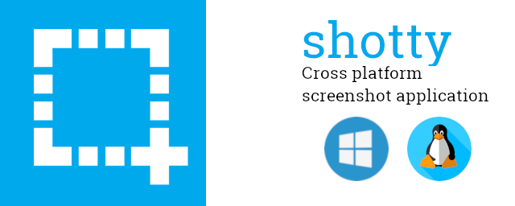
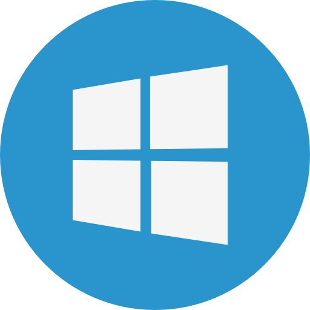
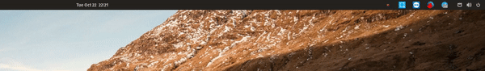

# shotty

    

Simple desktop screenshot app, written in Python with PyQt5

## Features

- Whole screen screenshot
- Region screenshot
- Save to disk
- Copy to clipboard
- Run in the background
- Hotkey
- Cross-platform

## Supported OS

     Windows
     Linux

### Region screenshot

Press 'Print', select your area, rename, and hit save!

### Icon tray menu - full screenshot

## How to run

See [requirements](#requirements) for python packages. With python >= 3.6, run 

    python app.pyw

## Requirements

### Windows:

Get pyHook for your python version here:

    https://www.lfd.uci.edu/~gohlke/pythonlibs/#pyhook

### Python

Linux

    pip install linux-requirements.txt

Windows

    Pip install windows-requirements.txt

## Troubleshoot ⚠️

### Linux

If you get the error:
    [Errno 2] No such file or directory: 'notify-send': 'notify-send'
try:
    
    sudo apt-get --reinstall install libnotify-bin notify-osd

## Author

- Victor Meunier - [victormeunier.dev@gmail.com](mailto:victormeunier.dev@gmail.com)

Want to support me? Buy me a coffee!

- credits to [dAKirby309](http://www.iconarchive.com/artist/dakirby309.html) for the app icon
- 
Windows icon made by <a href="https://www.flaticon.com/authors/pixel-perfect" title="Pixel perfect">Pixel perfect</a> from <a href="https://www.flaticon.com/"             title="Flaticon">www.flaticon.com</a>

- 
Linux icon made by <a href="https://www.flaticon.com/authors/freepik" title="Freepik">Freepik</a> from <a href="https://www.flaticon.com/"             title="Flaticon">www.flaticon.com</a>

